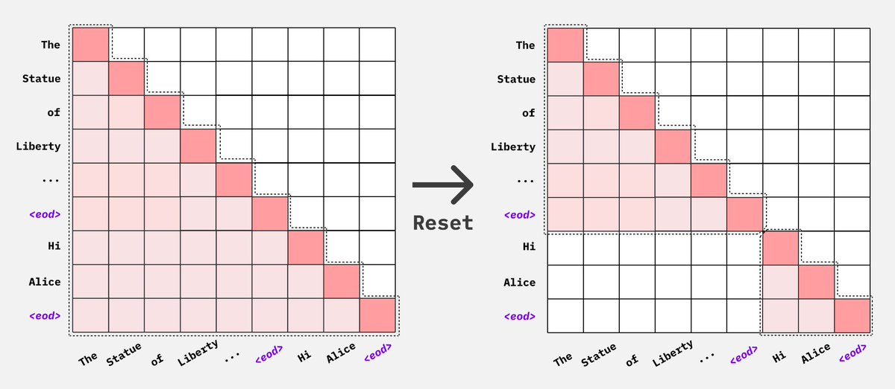

## Visualization of Multipack with Flash Attention

Because Flash Attention simply drops the attention mask, we do not need to
construct a 4d attention mask. We only need to concatenate the sequences into
a single batch and let flash attention know where each new sequence begins.


4k context, bsz =4,
each character represents 256 tokens
X represents a padding token

```
   0 1 2 3 4 5 6 7 8 9 0 1 2 3 4 5
[[ A A A A A A A A A A A ]
   B B B B B B ]
   C C C C C C C ]
   D D D D ]]

[[ E E E E E E E E ]
 [ F F F F ]
 [ G G G ]
 [ H H H H ]]

[[ I I I ]
 [ J J J ]
 [ K K K K K]
 [ L L L ]]
```

after padding to longest input in each step
```
   0 1 2 3 4 5 6 7 8 9 0 1 2 3 4 5
[[ A A A A A A A A A A A ]
   B B B B B B X X X X X X ]
   C C C C C C C X X X X ]
   D D D D X X X X X X X ]]

[[ E E E E E E E E ]
 [ F F F F X X X X ]
 [ G G G X X X X X ]
 [ H H H H X X X X ]]

[[ I I I X X ]
 [ J J J X X ]
 [ K K K K K ]
 [ L L L X X ]]
```

w packing ( note it's the same effective number of tokens per step, but a true bsz of 1)
```
   0 1 2 3 4 5 6 7 8 9 0 1 2 3 4 5
[[ A A A A A A A A A A A B B B B B
   B C C C C C C C D D D D E E E E
   E E E E F F F F F G G G H H H H
   I I I J J J J K K K K K L L L X ]]
```

cu_seqlens:
[[ 0, 11, 17, 24, 28, 36, 41 44, 48, 51, 55, 60, 64]]


## Multipack without Flash Attention

Multipack can still be achieved without Flash attention, but with lower packing
efficiency as we are not able to join multiple batches into a single batch due to
context length limits without flash attention. We can use either Pytorch's Scaled
Dot Product Attention implementation or native Pytorch attention implementation
along with [4d attention masks](https://github.com/huggingface/transformers/pull/27539)
to pack sequences together and avoid cross attention.



## Multimodal sample packing

Sample packing also works for multimodal (VLM) runs. It packs pre-tokenized VLM rows into full-length sequences at the sampler level and concatenates their tensors (including media such as `pixel_values`) at collation. For multimodal, packing automatically uses the balanced-greedy knapsack strategy rather than first-fit-decreasing, which distributes variable-length image rows more evenly across bins.

Multimodal packing requires pre-tokenization: each row is packed by its `length` column, which accounts for the expanded image tokens plus text. That column (and the cached media) only exist once the dataset has been prepared, so you must NOT set `skip_prepare_dataset: true` — leave it unset or `false`. You must also set `remove_unused_columns: false` so the media columns survive collation. Axolotl validates these constraints and will raise a clear error if `skip_prepare_dataset` is left on, or if `remove_unused_columns` is not false, when packing a multimodal run.

```yaml
processor_type: AutoProcessor
sample_packing: true
remove_unused_columns: false
# do NOT set skip_prepare_dataset: true — packing needs the prepared `length` column + cached media
```

Multimodal packing needs a prepared, non-streaming dataset, so it cannot be combined with `streaming: true` or `pretraining_dataset` — those use a different streaming-multipack collator that would silently drop the cached media. Axolotl raises a clear error for that combination. For the same reason, `excess_length_strategy: truncate` never slices a multimodal row: truncating its input_ids would desync the expanded image tokens from `pixel_values`, so an over-long media row raises instead. Use `excess_length_strategy: drop` (the default) or raise `sequence_len` to handle over-long multimodal rows.

Cross-attention vision models (e.g. mllama / Llama-3.2-Vision), whose inputs carry a `cross_attention_mask`, are not supported for sample packing: the packed mask would need a block-diagonal layout over the pack's total images that the collator does not yet build, so packing raises a clear error for them — set `sample_packing: false` for those models. Decoder-only VLMs that represent images as in-sequence tokens (Qwen2-VL/Qwen3-VL, Gemma3, InternVL, SmolVLM/Idefics3, Llava, Pixtral, etc.) are supported; packing has been forward-validated on Qwen3-VL, InternVL3, Gemma3, and SmolVLM (single- and multi-GPU), with Pixtral's variable-resolution `pixel_values` padded and stacked to the layout its vision tower expects.

See `examples/qwen2_5-vl/lora-7b-packed.yaml` for a runnable config.
