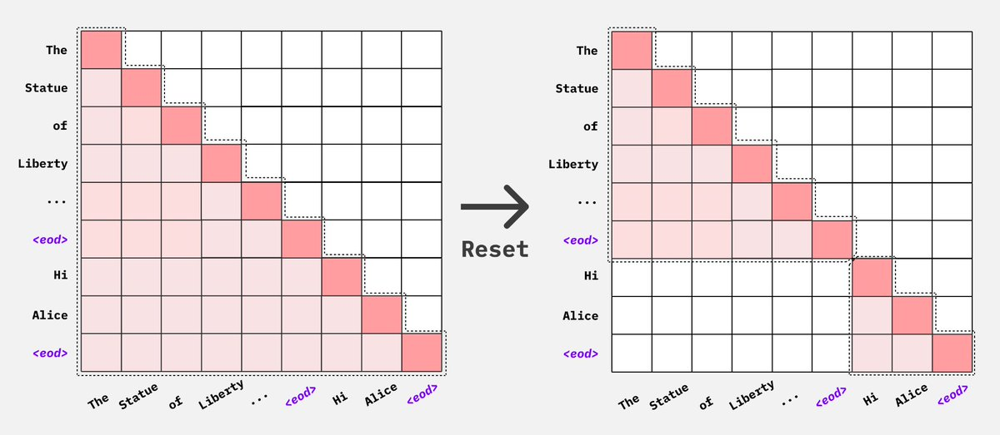

## Visualization of Multipack with Flash Attention

Because Flash Attention simply drops the attention mask, we do not need to
construct a 4d attention mask. We only need to concatenate the sequences into
a single batch and let flash attention know where each new sequence begins.


4k context, bsz =4,
each character represents 256 tokens
X represents a padding token

```
   0 1 2 3 4 5 6 7 8 9 0 1 2 3 4 5
[[ A A A A A A A A A A A ]
   B B B B B B ]
   C C C C C C C ]
   D D D D ]]

[[ E E E E E E E E ]
 [ F F F F ]
 [ G G G ]
 [ H H H H ]]

[[ I I I ]
 [ J J J ]
 [ K K K K K]
 [ L L L ]]
```

after padding to longest input in each step
```
   0 1 2 3 4 5 6 7 8 9 0 1 2 3 4 5
[[ A A A A A A A A A A A ]
   B B B B B B X X X X X X ]
   C C C C C C C X X X X ]
   D D D D X X X X X X X ]]

[[ E E E E E E E E ]
 [ F F F F X X X X ]
 [ G G G X X X X X ]
 [ H H H H X X X X ]]

[[ I I I X X ]
 [ J J J X X ]
 [ K K K K K ]
 [ L L L X X ]]
```

w packing ( note it's the same effective number of tokens per step, but a true bsz of 1)
```
   0 1 2 3 4 5 6 7 8 9 0 1 2 3 4 5
[[ A A A A A A A A A A A B B B B B
   B C C C C C C C D D D D E E E E
   E E E E F F F F F G G G H H H H
   I I I J J J J K K K K K L L L X ]]
```

cu_seqlens:
[[ 0, 11, 17, 24, 28, 36, 41 44, 48, 51, 55, 60, 64]]


## Multipack without Flash Attention

Multipack can still be achieved without Flash attention, but with lower packing
efficiency as we are not able to join multiple batches into a single batch due to
context length limits without flash attention. We can use either Pytorch's Scaled
Dot Product Attention implementation or native Pytorch attention implementation
along with [4d attention masks](https://github.com/huggingface/transformers/pull/27539)
to pack sequences together and avoid cross attention.



## Balancing supervised tokens

For datasets with masked prompts, similarly sized packed batches can contain very
different numbers of supervised tokens. Enable label balancing with:

```yaml
sample_packing: true
balance_packed_labels: true
```

The sampler first packs by context length, then balances the number of unmasked
labels across full batches in windows of 64 batches. It groups complementary
packed rows, attempts capacity-safe sample swaps, and tries local repacking when
swaps cannot improve the balance. Search is limited to four passes per window.
Only improvements are retained: no extra rows are allocated, no retained samples
are added or removed, and the incomplete final batch is left unchanged. Aggregate
packing utilization is preserved; individual batches can have different token
occupancy. Trainer and streaming integration also respect the collator's padding
multiple, rejecting changes that would increase the total padded tensor size.
Exact label equality is not guaranteed for indivisible samples.

This works with both flattened batches and `multipack_real_batches: true`. These
are local microbatch layouts. With packing-aware attention, the default is one
packed row with capacity `micro_batch_size * sequence_len` per rank. With
`multipack_real_batches: true`, each rank instead receives `micro_batch_size`
packed rows, each with capacity `sequence_len`. Under the default Accelerate
`split_batches: false`, data parallelism shards whole microbatches across ranks.
Four ranks with microbatch size one therefore process four rows globally; this
is distinct from balancing four rows jointly inside one rank's microbatch.
Tokenized label counts are read once per sampler construction and reused across
epochs. For causal loss, counts exclude the first label of each packed row;
precomputed `shift_labels` are counted directly. Exchanges also preserve the total
number of loss-bearing labels. The resulting full batches are shuffled within
each window using the training seed and epoch.

For streaming SFT and pretraining, balancing runs independently within each
`streaming_multipack_buffer_size` chunk, after tokenization and length filtering.
It uses the existing flattened capacity of `micro_batch_size * sequence_len`.
When pretraining examples omit labels, counts match the labels created from
`input_ids` during collation. No label metadata or samples are retained across
chunks. Fully supervised pretraining already has label counts close to context
lengths, so it may benefit less than data with masked prompts.

Label balancing requires causal LM data with fixed tokenized labels (or pretraining
labels derived from input IDs) and right padding. It is incompatible with
sequential/curriculum sampling, reward models, and diffusion or RL training. It
applies to packed evaluation as well as training. For map-style data, an additional accumulation-aware ordering pass smooths
update totals using the configured gradient accumulation and rank count. This
does not replace token-weighted loss normalization. Collators that dynamically
change label masking are not supported.

`generate_batches()` exposes `sampler.label_metrics` with `before` and `after`
summaries when label metadata is available. Each summary contains `batches`,
`packed_rows`, `mean_packed_length` (without padding), `mean_label_count`,
`std_label_count` (population standard deviation), and `total_label_count`.
Label counts are per microbatch, summed over its packed rows. Passing
`set_stats=True` also logs the summaries, including when batches were previously
cached. These describe the generated plan after `drop_last`, before distributed
sharding or minimum-length truncation; they are not measured per-rank training
or gradient-accumulation statistics.

With balancing enabled, random sampling and balancing use the configured seed
plus epoch, independently of rank-local RNG state. Identical input datasets,
metadata, and packing settings therefore produce identical plans before rank
sharding. Existing distributed length synchronization and sharding remain in
place. Custom input samplers must themselves yield the same order on each rank
when used with this shared-plan sharding scheme.

Checkpoint resume reconstructs the balanced plan from its seed and epoch; the
Trainer skips the microbatches already consumed in that epoch. Axolotl forwards
the restored epoch to both balanced samplers before Accelerate adds its resume
wrappers, clearing any cached plan from another epoch. The saved `TrainerState`
epoch position determines the resume offset, since differing packed epoch
lengths can make a position inferred from `global_step` inaccurate.
The samplers do not keep
a second consumed-batch cursor, which would conflict with Trainer skipping and
DataLoader prefetching. Exact continuation requires the same dataset order,
seed, packing settings, microbatch size, data-parallel size and accumulation
grouping, with `ignore_data_skip: false`. This applies to map-style training;
streaming still relies on the iterable dataset's existing resume behavior.

## Balancing fixed-count flattened batches

For ordinary batch flattening, keep sample packing disabled:

```yaml
sample_packing: false
batch_flattening: true
balance_packed_labels: true
micro_batch_size: 4
```

`FlatteningAwareRandomSampler` yields ordinary scalar dataset indices. Each full
microbatch still contains exactly four original samples in this example; the
flattening collator concatenates them into one variable-length row. The sampler
balances both the sum of sequence lengths and the count of supervised labels
across microbatches. Counts account for the collator masking the first label of
every source sample, independently of the causal loss shift.

Within shuffled windows of at most 64 full microbatches, it tries greedy
regrouping followed by four passes of paired sample swaps. Candidates are accepted
only if neither length variance nor label-count variance increases, at least one
improves, and the window's peak flattened token length does not increase. This
preserves coverage, fixed sample counts and the original distributed drop-last
tail. It can leave unavoidable imbalance when the two objectives conflict.

The sampler uses the data seed (falling back to the training seed) and epoch,
independently of rank-local RNG. Existing DataLoader batching and distributed
sharding apply. The opt-in path requires a map-style tokenized dataset, the
standard flattening collator with `separator_id=-100`, and
`accelerator_config.split_batches: false`. It cannot be combined with streaming
pretraining, curriculum sampling or length-grouped sampling. Streaming sample
packing continues to use its separate chunked balancing path.

`sampler.label_metrics` reports before/after length mean, standard deviation and
maximum, plus label mean, standard deviation and total. These describe the
unsharded plan including the final partial batch. The accumulation-aware pass described below further smooths label totals
without changing any flattened microbatch or its length.


## Accumulation-aware ordering

For map-style packed and fixed-count flattened training, `balance_packed_labels`
receives a normalized `batches_per_optimizer_step` from the trainer: data-parallel
replicas multiplied by `gradient_accumulation_steps`. Both `MultipackBatchSampler`
and `FlatteningAwareRandomSampler` use this same grouping value. With accumulation
steps times rank count greater than one, a second pass reorders whole microbatches across up to
16 complete optimizer updates. With `W` ranks and `G` accumulation steps, each
update spans `W * G` batches of the common plan; rank `r` consumes every `W`th
batch. This requires the standard whole-batch sharding (`split_batches: false`).

Greedy assignment balances the total labels across all ranks and microsteps in
each optimizer update. A candidate is accepted only if global-update label
variance decreases. Per-rank totals are not an objective. These
comparisons are against the plan after microbatch balancing, not the original
random plan. No microbatch contents, padding, lengths or individual label counts
change in this pass. The incomplete final accumulation window stays in place.
The pass can leave unavoidable imbalance; individual ranks' totals and temporal
variances are not constrained.

Metrics include `before`, `before_accumulation`, and `after` summaries, with
`mean_global_update_labels`,
`std_global_update_labels`, `updates`, and `excluded_tail_microbatches`.
Update metrics exclude partial accumulation windows and partial microbatches;
ordinary microbatch statistics retain their existing tail semantics. These are
plan statistics, not measurements of runtime loss normalization or arbitrary
custom sharding. Streaming retains chunk-local microbatch balancing: this pass
is not enabled there because accumulation windows can cross chunk boundaries.
